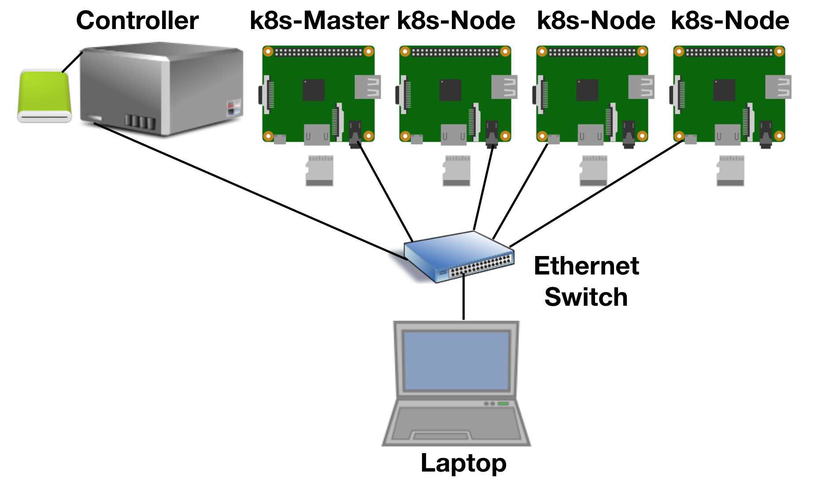
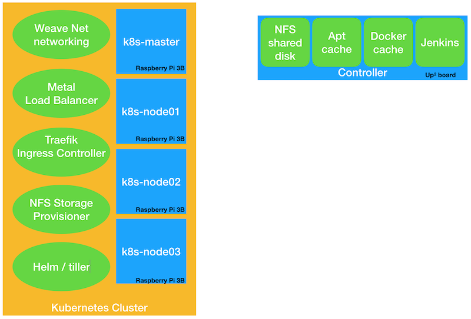

# k8s-RaspberryPi

This project aims to create a process that as far as is possible will automate the setup of a Raspberry Pi Kubernetes cluster.

The initial steps of flashing the SD cards and creating the base Raspberry Pi image is a one time process, but once completed, this project will enable automated teardown and rebuild of the Kubernetes cluster.

The project relies on a central *controller* machine, which I chose not to be a Raspberry Pi, which is a Linux machine with Ethernet connectivity that exports a NFS share.  This will host the filesystems of all the Raspberry Pi machines.  The NFS share will also provide storage to the Kubernetes cluster.

The basic cluster will comprise of the following setup

The following documents (in the docs folder of this repo) have all the details you need to create your own Kubernetes cluster:

1. [Hardware](docs/hardware.md) - details of my hardware setup
2. [Initial setup](docs/setup.md) - how to do the initial setup of infrastructure
3. [Raspberry Pi automated installs](docs/piInstall.md) - the scripts to automate the setup of the Raspberry Pis